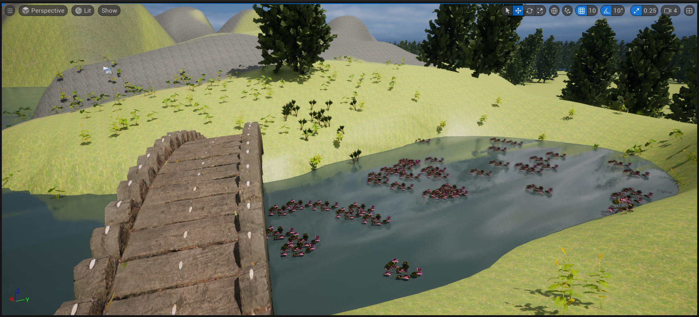

# Experiment:08 – Implementing_landscape_foliage_landscape material
## AIM:
To Create a landscape, add foliage, apply landscape material
 
 
## ALGORITHM:

### STEP-1: Create a new landscape:
1. In the Modes panel, under the Place tab, select Landscape.
2. Click and drag in the level viewport to define the size of the landscape.
3. Adjust the landscape settings, such as the number of components, section size, and overall resolution, to fit your needs.
4. Click the Create button to generate the landscape.
### STEP-2: Sculpt and paint the landscape:
1. With the landscape selected, go to the Landscape tab in the Modes panel.
2. Use the Sculpt tools to modify the shape of the landscape, such as raising, lowering, or smoothing the terrain.
3. Use the Paint tools to apply different textures and materials to the landscape, such as grass, dirt, or rocks.
4. Experiment with different brushes and settings to achieve the desired look for your landscape.
### STEP-3: Add foliage to the landscape:
1. In the Modes panel, under the Place tab, select Foliage.
2. Choose the foliage type you want to add, such as trees, bushes, or flowers.
3. Click and drag in the level viewport to place the foliage instances on the landscape.
4. Adjust the density, scale, rotation, and other parameters to achieve a natural distribution of foliage.

### STEP-4: Create and apply a landscape material:
1. In the Content Browser, right-click in the desired folder.
2. Select Materials & Textures > Material.
3. Double-click the newly created material to open it in the Material Editor.
4. Create the desired material setup by connecting nodes, textures, and parameters.
5. Connect a Landscape Layer Blend node to control the distribution of different textures on the landscape.
6. Assign the material to the landscape by selecting the landscape and setting the Material property to the newly created material.

### STEP-5: Configure landscape material layers:
1. In the Landscape Layer Blend node, add layers for different textures.
2. Set the Layer Info property of each layer to the appropriate landscape layer info asset.
3. Adjust the parameters of each layer, such as texture, tiling, and blending settings.
4. Use the brush tools in the Landscape tab to paint the landscape with different textures based on the configured layers.

### STEP-6: Refine and optimize the landscape:
1. Fine-tune the landscape by adjusting the sculpting, painting, and foliage placement.
2. Optimize performance by adjusting the landscape LOD settings and culling options.
3. Experiment with different material settings and foliage variations to achieve the desired visual quality and performance balance.

### STEP-7: Test and iterate:
1. Play the game in the editor to explore and experience the created landscape.
2. Make adjustments based on the visual and gameplay feedback, refining the landscape and foliage as needed.
3. Iterate on the design, adding more details, adjusting materials, and optimizing performance until you achieve the desired result.

## OUTPUT:
### FULL VIEW

### player view

  
 
 
 
 
 
 
RESULT:
Thus, landscape, foliage, landscape material has been created and played.
 
 
 
 
